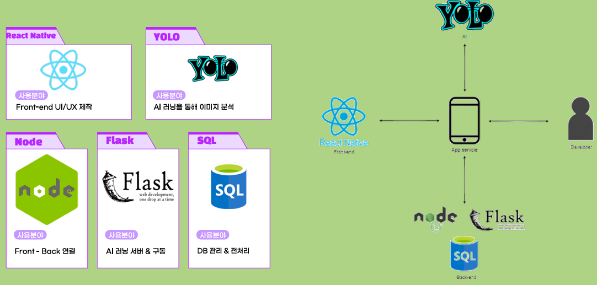

# AI Recipe Assistant 

React Native(Expo) 프론트엔드, Node.js 백엔드, Flask + YOLO 기반 AI 이미지 분석 서버, SQL(DB) 구성을 사용한 레시피 보조 애플리케이션 프로젝트입니다.

## 프로젝트 개요

- 사용자가 앱에서 이미지를 업로드/촬영
- AI 서버(YOLO)가 이미지를 분석
- 백엔드(Node/Flask)와 DB를 통해 레시피/재료 정보를 연결
- 앱에서 결과를 확인할 수 있도록 UI 제공

## 아키텍처 구조도

아래 이미지는 프로젝트 아키텍처 구조도입니다.




## 기술 스택

### Frontend
- React Native (Expo)
- JavaScript / TypeScript

### Backend
- Node.js (Express)
- Flask (Python)

### AI / ML
- YOLO 기반 이미지 분석

### Database
- SQL (프로젝트 내 DB 연동 구조)

## 담당/구현 내용 (예시 정리)

- React Native UI/UX 화면 구성 및 앱 흐름 구현
- Node 서버를 통한 프론트-백엔드 연동
- Flask 서버 기반 AI 분석 요청/응답 처리
- SQL 기반 데이터 조회/관리 로직 구성

## 폴더 구조

```text
.
├─ frontend-expo/        # React Native(Expo) 앱
├─ node-server/          # Node.js / Express 서버
├─ flask-server/         # Flask + AI 관련 코드(포트폴리오용 코드만 포함)
├─ .gitignore
└─ README.md
```

## 실행 방법

### 1) Frontend (Expo)

```bash
cd frontend-expo
npm install
npx expo start
```

### 2) Node Server

```bash
cd node-server
npm install
node app.js
```

### 3) Flask Server (AI)

```bash
cd flask-server
pip install -r requirements.txt
```

추가로 `flask-server/code` 내부 스크립트/환경에 맞춰 실행합니다.

## 포트폴리오 저장소 구성 안내

이 저장소는 포트폴리오 업로드용으로 정리된 버전입니다.

- 포함: 코드, 설정 파일, 화면/앱 리소스(일부)
- 제외: `node_modules`, `.env`, 대용량 데이터셋, 모델 가중치(`*.pt`), 로컬 개발 환경 파일

필요한 대용량 파일(예: 모델 파일, 데이터셋)은 별도 저장소/클라우드 링크로 관리하는 방식을 권장합니다.

## 개선 아이디어

- AI 모델 추론 API 명세 문서화
- 배포 환경 분리 (Dev / Prod)
- 예외 처리 및 로깅 고도화
- 테스트 코드 추가 (API / UI)

